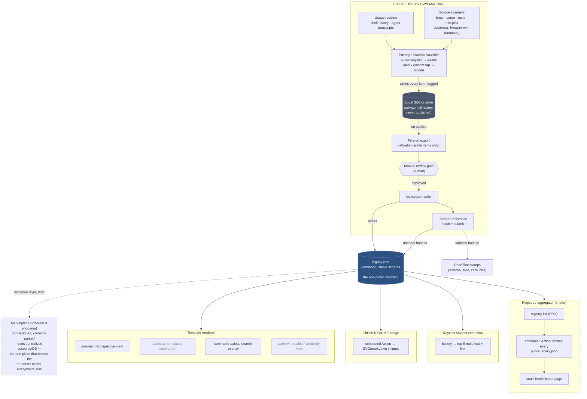

# Legacy — Architecture

System-level component map, covering every feature in `NORTH-STAR.md` — built, deferred, and parked. For *why* any of this is shaped this way, see `IDEATION.md`; for locked decisions, see `CLAUDE.md`. This doc is the "what talks to what," not a new source of reasoning — keep it in sync with `IDEATION.md` rather than drifting from it.

## The shape that matters

Everything downstream of `legacy.json` is a pure reader. The renderer, the GitHub badge action, the Raycast extension, and the registry/aggregator never talk to each other or to a server — each just fetches one file over plain HTTP. The detector is the only component with real privileges (filesystem/shell access), and the marketplace is the only component that would need any (accounts/DB) — which is exactly why it's a separate, later build rather than a feature bolted onto the rest.

## Components

**Detector** (local, the only privileged component)
- Source scanners — pluggable per ecosystem, one per source (Homebrew Cellar/casks, cargo, npm globals, `/Applications` `Info.plist`). Browser extensions and hardware (`system_profiler`) are researched and feasible but deferred to v1.1.
- Usage readers — shell history (zsh/bash/fish) and AI-agent transcript parsing, separate from inventory scanning since usage ≠ presence.
- Privacy/allowlist classifier — tags every detected item by `ToolSource` (public-registry vs. `.local`/custom-tap) before it reaches storage, plus a denylist-by-name safety net for known-sensitive vendors.
- **Local SQLite store** — the detector's actual working state. Everything detected, tagged, and timestamped, across every scan. Never published. This is what makes the "journey over time" narrative possible: diffing checkpoints, tracking first-seen/last-seen per tool, remembering manual review decisions across runs.
- Filtered export — on publish, pulls only allowlist-visible items out of SQLite as a candidate snapshot.
- Manual review gate — a human approves the diff before anything becomes public. Non-negotiable, non-automatable (see `IDEATION.md`'s privacy model — this is a direct callback to the accidental `stackshare` publish that started the project).
- `legacy.json` writer — serializes the approved snapshot to the stable, versioned schema.
- Tamper-resistance — hashes the published `legacy.json`, submits the hash (not the data) to OpenTimestamps' free public calendar servers, stores the returned `.ots` proof alongside the manifest. Zero infrastructure of our own.

**`legacy.json`** — not a runtime component, the contract. The only thing every other piece depends on. Needs its own versioned schema (JSON Schema + validator) so the detector, renderer, and eventual registry can all parse it independently, indefinitely.

**Template renderer** — cloned by each person, no server, reads the owner's own `legacy.json` from wherever they point it (their own repo/gist). Journey/retrospective view is the default; simulated-desktop UI and the command-palette search overlay layer on top once that's proven; the hireable/credibility view stays parked until Problem 3 is picked back up.

**Distribution add-ons** — small, independent, read-only against `legacy.json`, no new detection logic: a GitHub Action generating a README badge, and a separate Raycast extension for the snippet-trigger idea.

**Registry/aggregator** (v-later, deliberately deferred, its own repo entirely) — PR-based opt-in list, a scheduled GitHub Action that fetches everyone's public `legacy.json`, a static leaderboard page. Safe to defer indefinitely since every individual page keeps working with or without it.

**Marketplace** (Problem 3's endgame) — not designed. The one component that would need centralized accounts/a real database, which is exactly why `IDEATION.md` treats it as a separate later build rather than a feature of the decentralized template.

## Open questions this doesn't answer

See `CLAUDE.md`'s "Open — not yet decided" for the current list (detector stack, exact `legacy.json`/SQLite schema, repo layout). This diagram reflects the shape of the system, not the resolution of those three.
