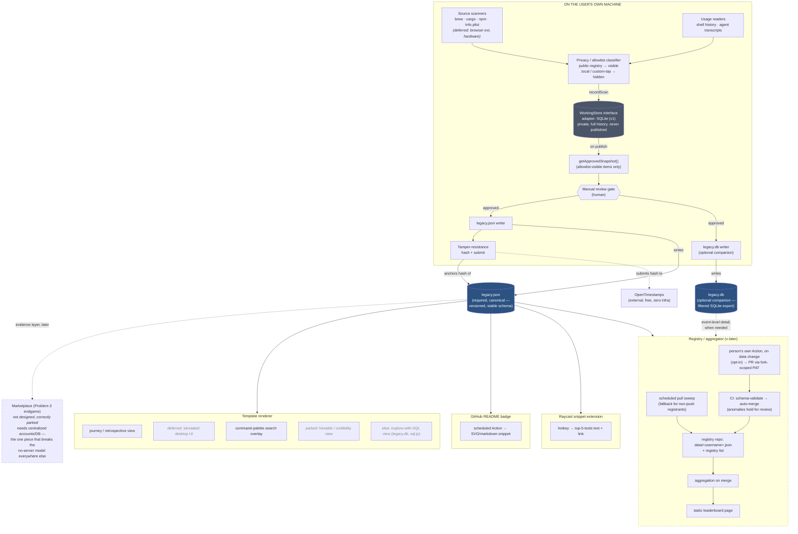

# Legacy — Architecture

System-level component map, covering every feature in `NORTH-STAR.md` — built, deferred, and parked. For *why* any of this is shaped this way, see `IDEATION.md`; for locked decisions, see `CLAUDE.md`. This doc is the "what talks to what," not a new source of reasoning — keep it in sync with `IDEATION.md` rather than drifting from it.

## The shape that matters

Everything downstream of the approved snapshot is a pure reader. The renderer, the GitHub badge action, the Raycast extension, and the registry/aggregator never talk to each other or to a server — each just fetches a file over plain HTTP. The detector is the only component with real privileges (filesystem/shell access), and the marketplace is the only component that would need any (accounts/DB) — which is exactly why it's a separate, later build rather than a feature bolted onto the rest.

## Components

Structure only — for *why* each piece is shaped this way, see `IDEATION.md`'s "Product decisions locked so far" and "Local storage engine options." Not repeated here.

**Detector** (local, the only privileged component) — source scanners (pluggable per ecosystem) → privacy/allowlist classifier → `WorkingStore` interface (`recordScan`, `getToolHistory`, `diffSince`, `recordReviewDecision`, `getApprovedSnapshot`, `exportRaw`/`importRaw`; `SqliteWorkingStore` is the only v1 adapter) → `getApprovedSnapshot()` → manual review gate (human) → two writers reading the same approved output → tamper-resistance (hashes + OpenTimestamps).

**`legacy.json`** (required) — the contract every other piece can assume exists. **`legacy.db`** (optional companion) — filtered SQLite export of the same snapshot, for direct querying.

**Template renderer** — cloned per person, no server, reads the owner's `legacy.json`. Journey/retrospective view is default; simulated desktop, search overlay, and an SQL-explore view (if `legacy.db` present) layer on top later; hireable/credibility view parked.

**Distribution add-ons** — GitHub README badge Action, Raycast snippet extension. Both read-only against `legacy.json`, no new detection logic.

**Registry/aggregator** (v-later, own repo) — push: each person's opt-in Action PRs `data/<username>.json` to the registry on change, auto-merged after CI schema validation; pull: scheduled fallback sweep for anyone not on push; aggregation runs on merge, recomputing the leaderboard from the registry's own `data/`.

**Marketplace** (Problem 3's endgame) — not designed. The one component needing centralized accounts/a real database.

## Open questions this doesn't answer

Canonical list: `IDEATION.md`'s "Open, not yet decided." This diagram reflects the shape of the system, not the resolution of those.
